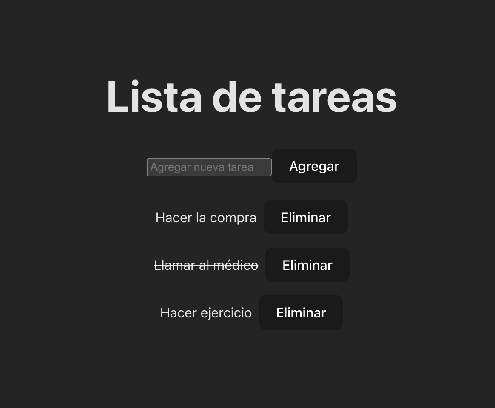

# Ejercicio de React: Entendiendo las Props
Este ejercicio tiene como objetivo ayudarte a comprender el concepto de props en React, que es una forma de pasar datos entre componentes.

## Objetivo
El objetivo de este ejercicio es crear una aplicación de lista de tareas simple utilizando componentes de React y pasando datos entre ellos mediante props.

### Pasos a Seguir
1. Clona el Repositorio e instala las dependecias
Recuerda siempre que debes hacer un `npm i` del repositorio para tener todas las dependencias instaladas


2. Entender la Estructura del Proyecto
`src/App.js`: Este es el componente principal de la aplicación donde se maneja el estado de las tareas y se definen las funciones para agregar, eliminar y marcar tareas como completadas.
`src/Task.js`: Este componente muestra una tarea individual y maneja los eventos de clic en la tarea.
`src/AddTaskForm.js`: Este componente proporciona un formulario para agregar nuevas tareas a la lista.

### Cada componente tiene:

#### * APP.jsx:
- Aquí tendremos de inicio unos datos como tareas para poder trabajar con ellos.

```js
const [tasks, setTasks] = useState([
    { id: 1, text: 'Hacer la compra', completed: false },
    { id: 2, text: 'Llamar al médico', completed: true },
    { id: 3, text: 'Hacer ejercicio', completed: false }
  ]);
```
Lo tendrás ya incluido en el proyecto

- Tendrás que crear una función llamada `addTask` que cree las tareas. Las tareas deben tener los siguientes datos:
1. Un id -> Contabilizaremos cuantos elementos hay en el array y añadiremos el suguiente número como `id`
2. Una tarea -> Sacaremos ese valor del input que tenemos que crear en `addTaskForm.jsx`
3. Tarea completada -> La crearemos por defecto en `false`

*** PISTA *** 

Recuerda que al añadir el la nueva tarea se tienen que mantener las anteriores.

- Necesitaremos una función `deleteTask` que elimine las tareas.

*** PISTA *** 

Para eliminar puedes usar algo así
```js
setTasks(tasks.filter(task => task.id !== taskId));
```

- Y tendrás que crear una función que al pulsar en la tarea se tache o se quite el tachado.

*** PISTA ***

Habrá que pasar el `complete` de false a true, y cuando esté en true la tarea saldrá tachada. Esta atributo tacha el texto `line-through` y se puede añadir como style en línea, de esta manera. Piensa que puedes hacer un ternario dependiendo la evalución de si está en `true` o `false`.
Esta función se activará o desactivará cuando hagamos click en cada una de las tareas. 

```js
style={{ textDecoration: 'line-through'}}
```

- Aquí, en App.jsx, también tendremos que pasarle propiedades a nuestros módulos
1. A `AddTaskForm` le pasaremos la función de añadir para usarla
2. A `Task` le pasaremos el `id` como `key`, la tarea, y las funciones de borrado y completado para poder usarlas en cada tarea.

Y también es donde haremos que se rendericen nuestros datos y componentes.

            
#### * AddTaskForm.jsx:
Crearemos un input que recoja el valor y añada las tarea al resto de tareas

#### * Task.jsx
Aquí tendremos cada una de las tareas con las funcionalidades de `borrar` y `marcar como completada`. 

#### CONSEJOS
- Hacedlo paso a paso.
- Comprobad que algo funciona antes de pasar a la siguiente tarea.
- Crea lo que vas a usar, lo que no, lo dejamos para el siguiente paso.

Aquí un ejemplo de como debería de quedar:



